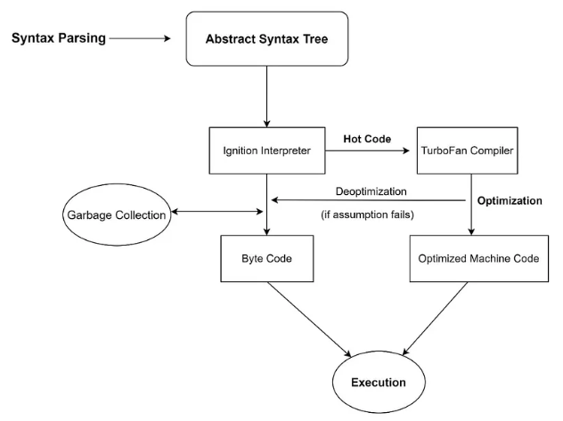

## Introduction

Node JS is runtime environment to execute codes on server, based on v8 engine (by google, C++ based) uses JIT compilation, executing codes faster. **Parsing** — creating abstract syntax tree AST, **Interpretation** — Ignition interpreter (keeping hot code, for optimization) to byte codes, **Optimization** — hot code to Turbo Fan compiler (uses inline caching, copy elision), converting into machine code, **De-Optimization** — when assumptions fail, discarding optimized code, Ignition re-interprets and then, compilation. **Garbage Collection** — uses mark-sweep algorithms to mark live variables & objects, sweeps unused ones. 

```jsx
console.log("Hello World !");
process.stdout.write("Another way to print");
console.table({city: ["jaipur", "delhi"], state: ["rajasthan", "delhi"]});

typeof(balance) --> return number (method to find data type)
console.log(`Hello! My name is ${username}`); // string interpolation
```

**Datatypes** — `string, number, boolean, bigint, undefined, null, Object`.  **Logical operations** — `&& (and), || (or), !)`. Back ticks allows to use variables in  string.



## Backend with Java Script

### Node JS & Express JS

`Ngnix` is HTTP web server, we connect this to our `src/` directory, where we have our static web-pages & backend logic. Also, much of the Node JS is built with asynchronous event-driven architecture with objects like `emitters`. 

```jsx
/* Writing your own server in pure Node JS */
server = http.createServer((req, res) => {
	fs.readFile(path.join(__dirname, req.url === '/' ? 'index.html' : `${req.url}`), 
		(err, content) => {
			if(!err) {
				res.writeHead(200, {"content-type": "text/html"});
				res.end(content, "utf-8");
			}
	})
});

server.listen(port=3000, () => {
	console.log("Server is successfully running on port 3000");
});

/* Creating logging functionality */
class Logger extends EventEmitter {
	log(message) {'message': {messsage}};
}

setInterval(() => {
  const memoryUsage = (os.freemem() / os.totalmem()) * 100;
  logger.log(`Current memory usage: ${memoryUsage.toFixed(2)}`);
}, 3000);

logger.on("message", logToFile);

const logToFile = (event) => {
  const logMessage = `${new Date().toDateString()} - ${event.message} \n`;
  console.log(logMessage);
  fs.appendFile(logFile, logMessage, (err) => {
    if (err) console.error("Error writing to the file: ", err);
  });
};
```

### **Database SQL vs NO-SQL**

They are required to store data persistently, major types includes SQL DB and NO-SQL DB (not-only SQL). We need Object-Relational Mapper ORM like `mongoose` to communicate with Mongo DB. SQL refers to Structured Query Language.